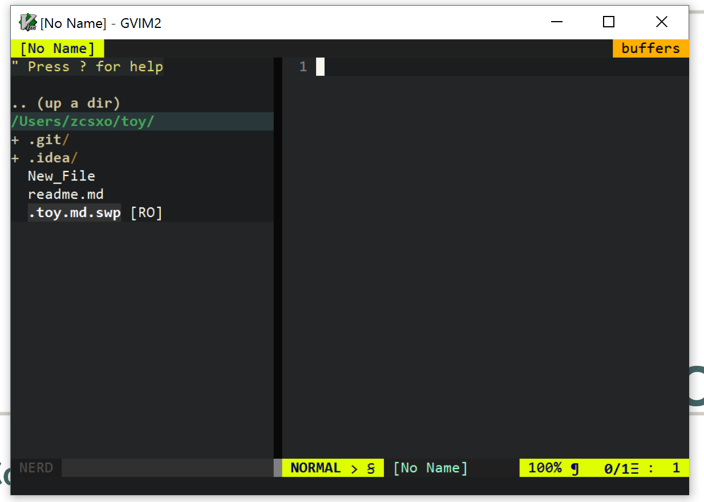

* **Please note that git is far more powerful than this blog can cover.**

If you want to learn more about git, 
I find this video helpful to establish some good git habits:
[Advanced Git Topic](https://channel9.msdn.com/events/MVP-RD-Americas/GitHub--Microsoft-Partnership/GH3-AdvancedGit-commits-stash-stagingarea).
This video is created by one of the employer of GitHub and bunch of Microsoft MVP's.


* **all the following demo is using gvim on windows 10 and powershell 5 with ConEmu**

## git folder

Because typically the source code of a software consists of many different files, 
therefore git only works in a folder, and keeps all the changes in this folder.

The identifier of a git folder is typically a `.git/` folder



on the left side of the editor (which is a file explore), you can see a `.git` directory, this is where git keeps all it's info.

### local and remote

Because one of the power of the git is to backup all your code on a remote server(which is just another computer that is connected to the internet),
therefore git need a `remote` server and your own `local` computer.

The syncing between the server (`remote`) and your current computer (`local`) is manual, not automatic real time syncing,
and also because there are other people using the same server to `colaborate` (which just means to edit the same code project at the same time), therefore there can be difference between local and remote.

The file on `remote` and `local` is all `git folders`.


## commit 
This is the hardest concept I will introduce in this article.

Commit is basically like a **saving point of your program**. 
Every time you created a commit means you have saved you current image of your program inside of a git.

* Noticed what saved inside of the git is actually the **difference between your current commit and your previous commit** .
Therefore when we say **"applying a commit to a program"** means redo all the actions you did from the last commit to a program.

For example, I have a code project looks like this:


After I added two line:


After I commit this change, the two lines, inside git will say that I added two lines on the `New_File`(this is the file name of the file I am changing) in this commit.
So if we say that "apply this commit to local" means add these two lines on the `New_File` on `local`(this is the concept we will encounter later) 


## add 

Add is a pre state of commit, this operation is basically choosing which file to commit.

If you have some file that is not useful to the software,
for example compiled binaries, like `test.exe` or `test.out`, you probably don't want to commit those.

Another example will be log file or dump file (those were the file to keep track of how your program is running and where did they crash).

Also if you have some file created by accidents, you definitely should not add those.

There are also some file created by IDE's and editors, like `.swp` file created by vim, `*~` file created by gedit and `.idea/` folder created by JetBrain IDE's (like pycharm)

## pull

Apply all the commit from remote to local (see the introduction about `commit` if you don't under stand what this means)

For example, if there is commit `A` and `B` are pushed to the remote by your teammate,
and you don't have them on your local.
But on your local you have commit `C` and `D`.

Then the branches looks like this:

```
        A - B  remote
      /
- E - - C - D  local
```

Then when you pull, git will apply the changes happened in `A` and `B` to your local:

```
        A - B          remote
      /
- E - - C - D - A - B  local
```

And then sort them in chronological order, let's say `A` is the first and followed by `C`, `B`, `D`:

```
        A - B          remote
      /
- E - - A - C - B - D  local
```

But the last change does not change the content at all. We will see why right now!

### auto merge

Git will try to merge your change and the remote change. 

Because the commits implies your change is valuable, git don't want to lose any of your change.

If on commit `C` you edited line 200 on file `a` and on commit `A` you teammate also edited file `a`, but on line 2.
This solution is obvious, just apply your change on line 200 and apply his/her change on line 2.

This way git merges two change without any conflict.

### manual merge

Thing does not always works out so nicely.

If you have edited line 200 on file `a` and your teammate also edited line 200 on file `a`.
Git thinks that both of your change is important, so he cannot discard any changes. 
Therefore he will show this changes and ask you, which change do you want me to keep? Or keep both changes?

The way git asks you is to display (see future article for exactly what happened here) all the changes,
and then you can edit those to choose which to keep.

Then add and commit and pull again to get up-to-date.

## push

Apply all the commit from local to remote (see the introduction about `commit` if you don't under stand what this means)

This can only happens after you pull, and these two operations will sync up your local and remote.

Here is what happens after you have done pull and merge:

```
        A - B          remote
      /
- E - - A - C - B - D  local
```

And after you push this becomes:

```
        A - C - B - D  remote
      /
- E - - A - C - B - D  local
```

## work flow

The basic git workflow will be looks like this:

```
add -> commit -> pull --- okay -----------------------------------------------------> push
                      \                                                           /
                       --> auto merge -- okay -----------------------------------/
                                      \                                         /
                                       - fail -> manual merge -> add -> commit-- 
```
